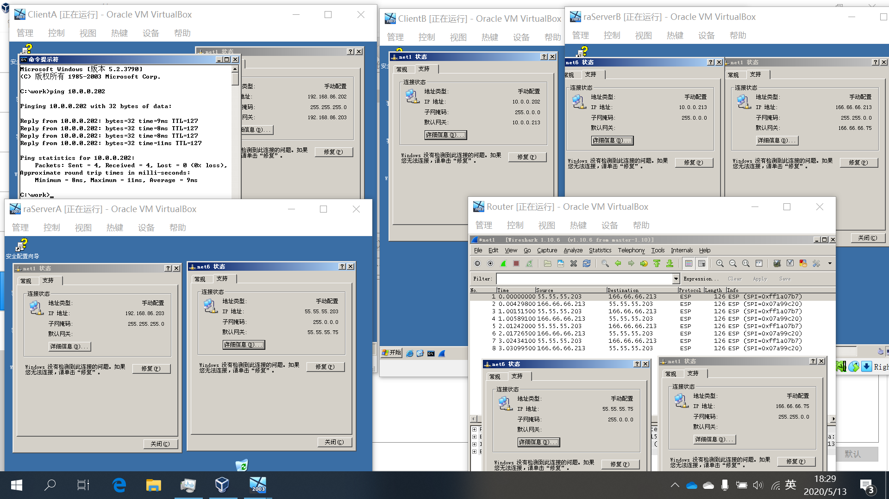

# Lab4 实验报告
#### PB17000075 何春望

## 实验结果
- ServerA, ServerB, Router 的 IPSec 策略按pdf教程配置并指派，Client 端指派为默认的`客户端（仅响应）`即可。
- 正确结果截图：
> 
- 五个虚拟机 IP 地址

  |    VM    |      IP1       |     IP2      |
  | :------: | :------------: | :----------: |
  | Client A | 192.168.86.202 |              |
  | Server A | 192.168.86.203 | 55.55.55.203 |
  | Router   | 166.66.66.75   | 55.55.55.75  |
  | Server B | 166.66.66.213  | 10.0.0.213   |
  | Clinet B |                | 10.0.0.202   |

## 实验总结
实验开始时，配置好 Server A 后直接复制虚拟机得到了 client 端，而没有更改指派的安全策略造成实验失败，在 ping 时提示 `Negotiating IP Security` 。猜测是IP安全策略导致，将两个 client 端重新指派为默认的“客户端”后成功建立了连接。
