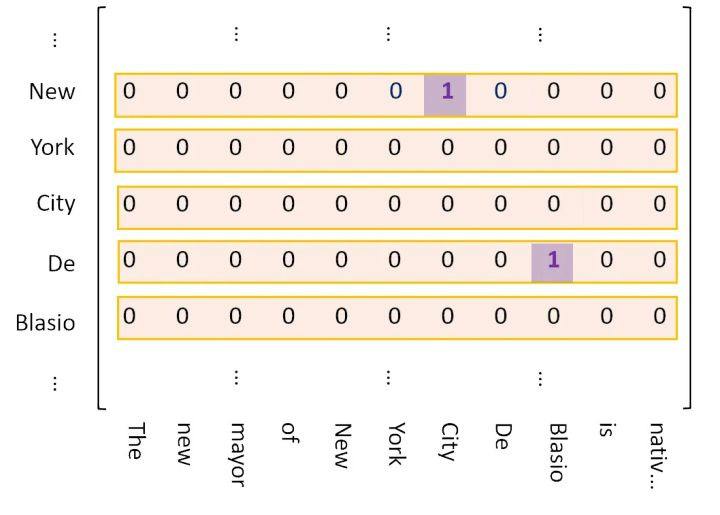
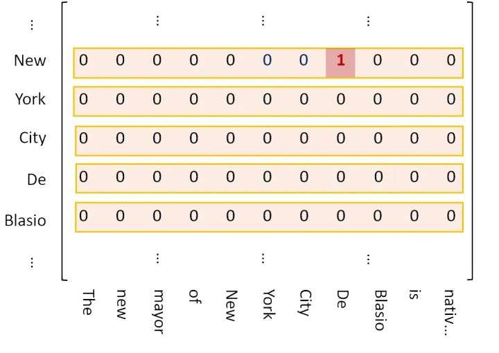
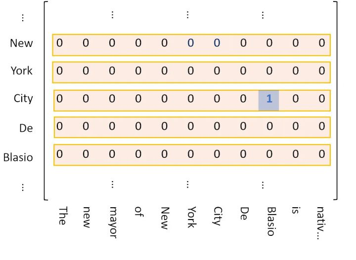
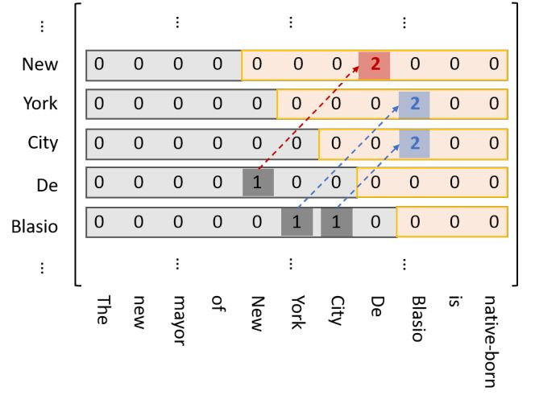
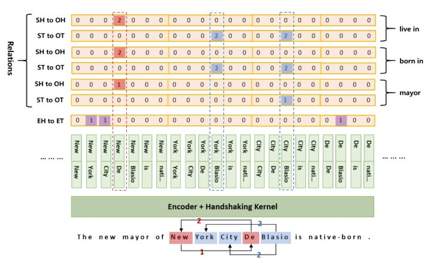
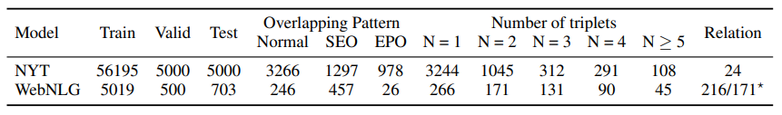
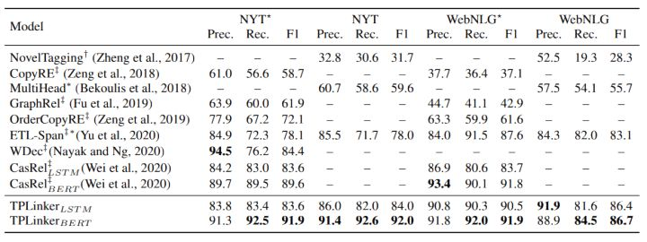
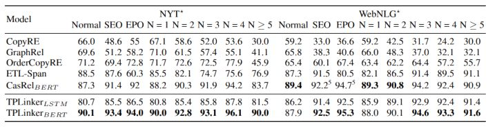
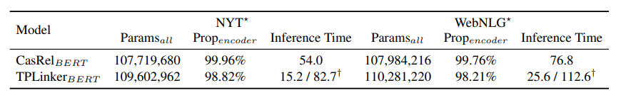
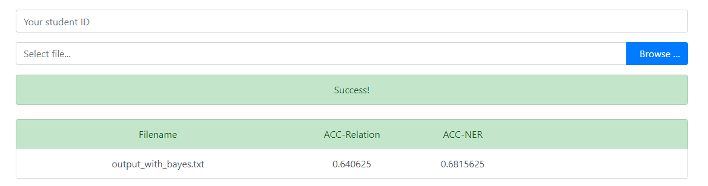

## <center> Web信息处理与应用 实验报告 </center>
### <center> lab2 </center>

### 团队成员
- 何春望 PB17000075
- 吴健宗 PB17000082

### 实验内容
本实验要求以给定的英文文本数据集为基础，实现一个信息抽取系统。

具体要求为，从一个句子中，提取实体（可选），并且判断实体关系类别。

### 任务背景调查
#### 关系抽取
是从非结构化文本中抽取实体和关系的文本处理技术，属于自然语言处理中的常见任务。它是自然语言理解的基础，在智能问答、信息检索等领域有重要应用。简单来说就是给定一段文本，要抽出其中的（subject, predicate, object）三元组。例如：

``` json
 {
   'text': '《邪少兵王》是冰火未央写的
   网络小说连载于旗峰天下',
   'relation_list': [
         {
             'subject': '邪少兵王', 
             'object': '冰火未央', 
             'predicate': '作者'
         },
   ]
 }
```

#### 常用方法
为了达到较好的结果，本实验中决定选用一个稳定且有效的深度学习方法进行关系抽取。以下是调研到的基于深度学习的信息抽取常用技术总结

关系抽取的方法一般有两类，分别是 pipeline 和 joint

Pipeline方法指先抽取实体、再抽取关系。联合抽取方法（joint）即同时抽取实体和关系。相比于传统的Pipeline方法，联合抽取能获得更好的性能。虽然Pipeline方法易于实现，这两个抽取模型的灵活性高，实体模型和关系模型可以使用独立的数据集，并不需要同时标注实体和关系的数据集。但存在以下缺点

1. 误差积累：实体抽取的错误会影响下一步关系抽取的性能。
2. 实体冗余：由于先对抽取的实体进行两两配对，然后再进行关系分类，没有关系的候选实体对所带来的冗余信息，会提升错误率、增加计算复杂度。
3. 交互缺失：忽略了这两个任务之间的内在联系和依赖关系。

因此，联合抽取方法相比pipeline方法应是更好的选择。

经过广泛的调研，我们选择了 COLING2020 的一篇论文 **《TPLinker: Single-stage Joint Extraction of Entities and Relations Through Token Pair Linking》。这篇论文是最新的基于joint方式进行的联合抽取实体关系的模型。主要创新点是提出了新的标注数据方法。它在数个公开数据集上取得了 SOTA 的结果

### 算法描述
#### 论文基本信息
论文题目：
《TPLinker: Single-stage Joint Extraction of Entities and Relations Through Token Pair Linking》

论文链接:
https://arxiv.org/abs/2010.13415

源码链接:
github.com/131250208/TPlinker-joint-extraction

以下对论文中的方法简称为 TPlinker

#### TPlinker 主要针对的问题

##### 1. 关系重叠
在关系抽取中，存在一个关系重叠的问题。即一个句子中，有多个关系重叠在相同的词中，导致模型难以分辨它们，例如：

||文本|关系|
|-|-|-|
|单实体重叠|	周星驰主演了《喜剧之王》和《大话西游》。	|（周星驰，演员，喜剧之王）（周星驰，演员，大话西游）|
|实体对重叠|	由周星驰导演并主演的《功夫》于近期上映。|	（周星驰，演员，功夫）（周星驰，导演，功夫）|

较早的联合抽取方法，如 NovelTagging，没法解决关系重叠的问题。当一个或一对实体同时出现在多个关系时，单纯的序列标注就不再管用了。

##### 2. 曝光误差
后来提出的一些方法已经可以解决重叠问题，如CopyRE  、CopyMTL 、CasRel（HBT） 等，但它们在训练和推理阶段的不一致性导致存在曝光偏差。即在训练阶段，使用了ground truth作为已知信息对训练过程进行引导，而在推理阶段只能依赖于预测结果。这导致中间步骤的输入信息来源于两个不同的分布，对性能有一定的影响。

虽然这些方法都是在一个模型中对实体和关系进行了联合抽取，但从某种意义上它们“退化”成了“pipeline”的方法，即在解码阶段需要分多步进行,这也是它们存在曝光偏差的本质原因。

##### 贡献
本文提出了一种新的实体关系联合抽取标注方案，可在一个模型中实现真正意义上的单阶段联合抽取，不存在曝光偏差，保证训练和测试的一致性。并且同时可解决多关系重叠和多关系实体嵌套的问题。

#### 算法介绍
TPLinker 将联合抽取描述为一个 token 对链接问题，并引入了一种新的握手标记方案，该方案将实体对中每个关系类型下的边界标记对齐。


如上图所示，一共有三种握手标记，紫色代表两实体各自内部的头尾握手，红色代表两实体头握手，蓝色代表两实体的尾握手。同一种颜色的握手标记，会被表示在同一个矩阵，接下来介绍这三个矩阵。 

1. 表示两个实体内部的头与尾

2. 标记两个实体头 token

3. 标记两个实体的尾 token


##### 优化内存：
上述的1号矩阵中，其标记点不可能出现在下三角区域，故可直接丢弃下三角区域；而对于2，3号矩阵，其标记点可能出现在下三角区域，但可以先把标记点映射到上三角区域，再丢弃下三角区域，注意：映射到上三角区域的标记点，记为“2”，而非“1”。



##### 模型结构:
模型比较简单，整个句子过一遍 encoder，然后将 token 两两拼接输入到一个全连接层，再激活一下输出作为 token 对的向量表示，最后对 token 对进行分类即可。换句话说，这其实是一个较长序列的标注过程。



> [上图的例子中，可以解码出5种关系] (New York City, mayor, De Blasio)， (De Blasio, born in, New York)， (De Blasio, born in, New York City) ，(De Blasio, live in, New York)，(De Blasio, live in, New York City)

##### 问题定义：
Token Pair Representation 对应着上图的 Encoder：


Handshaking Tagger 对应着上图的 Handshaking Kernel：


其中 P(...) 表示将链接 (wi, wj) 识别为 l（L的小写） 的概率。

损失函数：


其中，N 是输入的句子的长度， E，H，T 代表上图中的 EH-to-ET，SH-to-OH，ST-to-OT.

##### 数据集：
NYT 和 WebNLG，这两个数据集都给出了实体标记， 而关系，包括了普通关系 Normal，Entity Pair Overlap (EPO，多个subject对单个object)，Single Entity Overlap (SEO，两个实体间存在多种关系) ，具体例子请看本文章中的第二张图。



##### 实验结果：
与各种模型作对比的主要成绩：



当输入的句子复杂度增加，各种模型的成绩呈下降趋势，然而 TPLinker 表现出显著的提高：



在计算性能上，TPLinker 也表现出巨大的优势：



### 优化内容
在实际运行 TPlinker 模型时我们发现，对于部分测试数据，模型在关系抽取时的预测结果为空，进而导致实体识别的结果同样为空。因此，我们重新设计了一个只针对实现关系抽取的模型。通过对已有模型的调研，我们选择了朴素贝叶斯模型进行训练。

该贝叶斯模型仅负责进行关系抽取的任务，对测试集的预测结果可以达到41%，并且一个显著优点是训练速度极快，可以作为TPlinker 模型进行预测前对句子关系的一个基本判断。尤其是对原本没有输出的测试数据，加入贝叶斯模型的预测结果后，可以保证测试数据一定有有效输出。

### 实验结果
最终，关系抽取准确率为65%，实体识别准确率为68%。



### 总结
我们调研了关系抽取的最新研究成果，并且选择了一个算法，基于公开的代码，将其实现，并将之用于实验数据集进行测试。

在此过程中，加深了对关系抽取的理解，提升了实践水平。

### 参考资料
[1] TPLinker: Single-stage Joint Extraction of Entities and Relations Through Token Pair Linking. https://arxiv.org/abs/2010.13415
